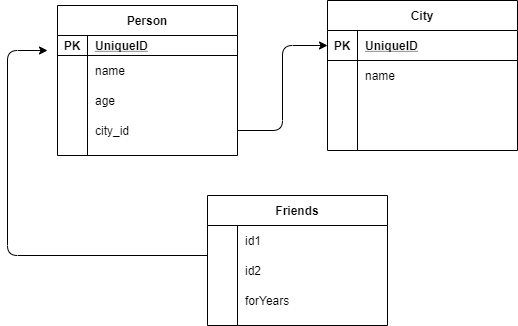
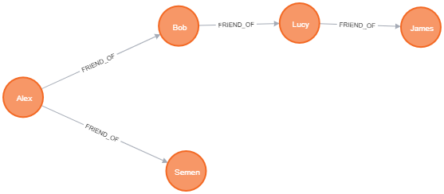
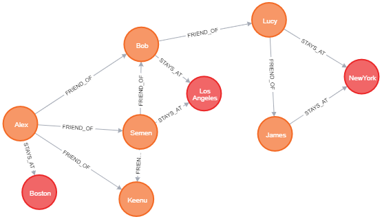

# Neo4j-example

## GraphDB ## 
 GraphDB is a database concept where they save the data that we have in graph topology.
That means they store data as nodes and edges which connect each node.  Node can also have properties and edges can also have properties.
This concept eases in finding relationship between nodes using edges, also traversing from node to node is easy.
Using this concept there are many databases. In this example we will see **Neo4j**.

There are mainly three building blocks of a neo4j - Node, Relationship, Properties. Let us Consider a simple example to better understand it like social media.
Here there will be entity Person he can have many friends, each person lives in a City, lets just consider this scenarios.

**RDBMS.** 
If we want to design this in RDBMS way - we can have three tables
1. Person - with name(String), age(Int), id, city_id
2. City - with name(String), id
3. Friends - with id, id, fromYears(int)

if one person is friend of another we store that in Friends table with id of both persons and when retreiving we can use join query to identify all the friends of a person.
This is fairly simple when we have two tables, but when we have huge business case this join queries become complex and time consuming. In cases like this graphdb helps us.
In graphdb this relationship is saved exactly how we draw that in a graph topology using links(pointers) between two entities relationship.

Below is the first set of things that we want to save with persons and friendship between them.

Now next thing is when we add city - we can add city as a seperate node and create relationship between each person and city where he recides.
Or you can even add a property called "residesAt" in person node for saving which city he stays in, but with second approach we will loose the ability to easily navigate to people staying at the same city. So lets use the first approach where we will save City as a node and add a relationship between person and city (this is a normalized form we do same thing in RDBMS by having new table for City and using foriegn key in Person table).

So when we consider City as another node this is how the graph looks

So to achieve this there are these constructs in Neo4J.
**Node** - is the main entity - which can have properties. For example  Person - Alex -  has name, age, leaves in some city. He has friends Bob, Semen, 
**Relationship** - is how each node is related to each other.  For Example  Alex is friend of Bob, Semen. Alex Follows Semen on social media, Bob and Semen leaves in City Boston.
 Even relationship can have properties like - Friend Of -relationship can have  from how many years.

## Cypher ##
Cypher is a Neo4j's query langauage used to create, insert, update, retrieve data from neo4j. It follows pattern matching approach to find what you nodes, relationships from the DB you want to retrieve.

Here i'm using docker desktop to run neo4j on my system, you can also download and run  community edition of neo4j on desktops for handson.

1. First step is to setup docker for desktop on your systems. use the below  link they have step by step to get it installed and run it.

https://docs.docker.com/desktop/

2. Then i use the below command to download and run container for Neo4j Community edition on my docker for desktop.

docker run --restart always --publish=7474:7474 --publish=7687:7687 --volume=$HOME/neo4j/data:/data neo4j:4.1.1

Once the container is up and running.  Go to http://localhost:7474/  from the browser, from there you can run your cypher queries and do all operations.

